# :no_mouth: Broadcast Blurred Image Processor

> 민감 정보 및 유해 콘텐츠 자동 블러 라이브 솔루션

## 🛠️ 역할 담당

<table align="left">
    <tr align="center">
        <td>
            김호진
        </td>
        <td>
            민예림
        </td>
        <td>
            육예진
        </td>
        <td>
            이상무
        </td>
        <td>
            정여진
        </td>
        <td>
            최장우
        </td>
    </tr>
    <tr align="center">
        <td>
            프론트엔드
        </td>
        <td>
            AI
        </td>
        <td>
            백엔드
        </td>
        <td>
            프론트엔드
        </td>
        <td>
            AI
        </td>
        <td>
            백엔드, 인프라
        </td>
    </tr>
</table>

 
 

## 개발 기간

2024.08.19. ~ 2024.10.11.

# 📌프로젝트 소개

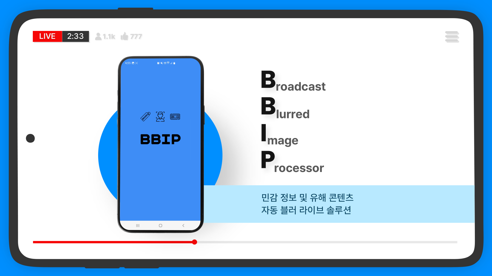 

## 🌟 주요 기능

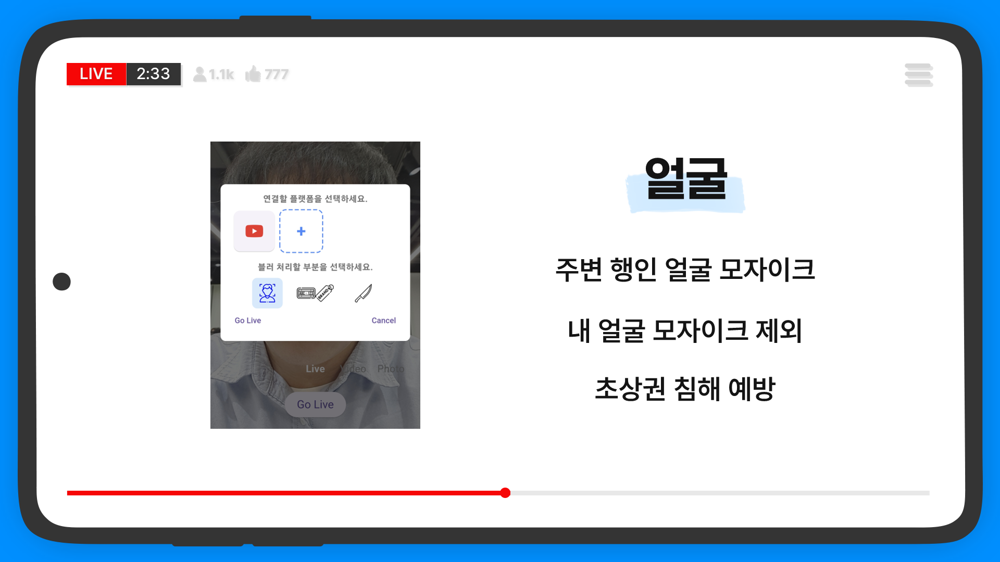 
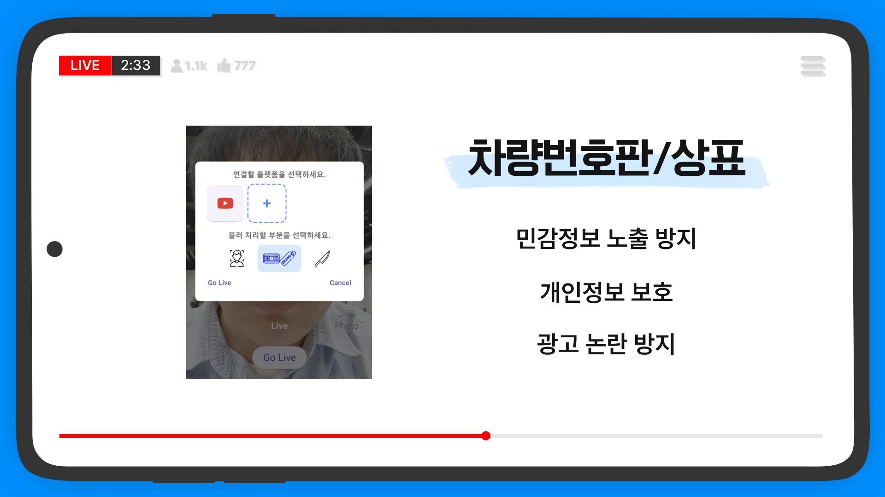 
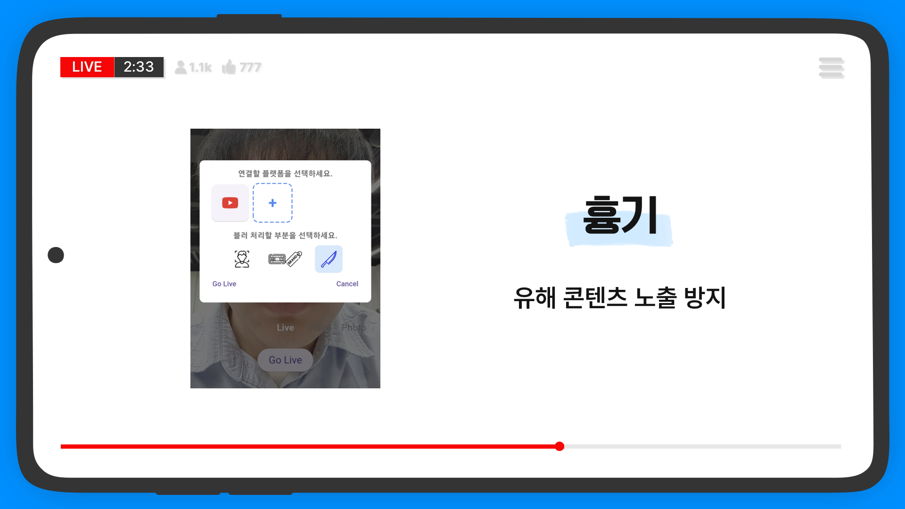 
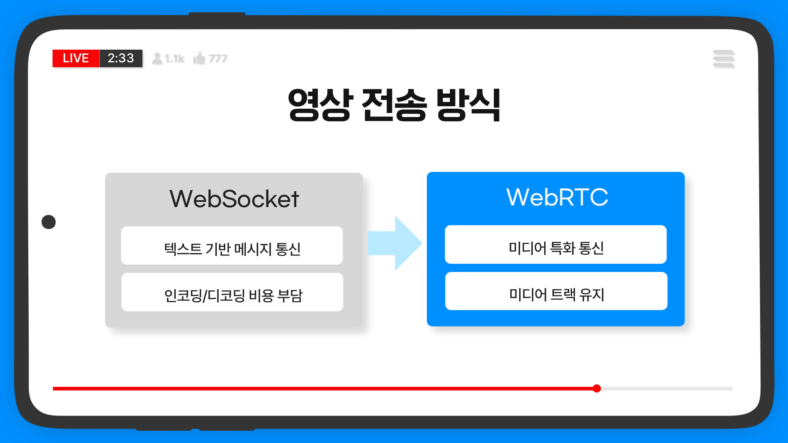 
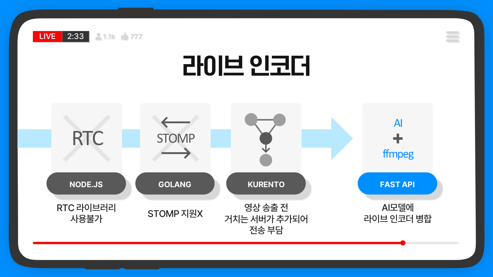 
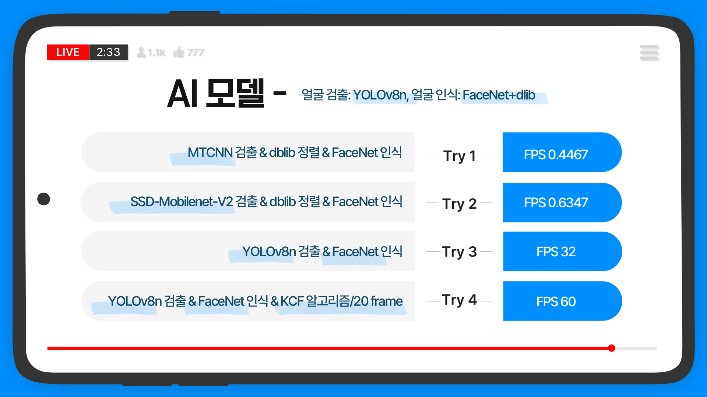 
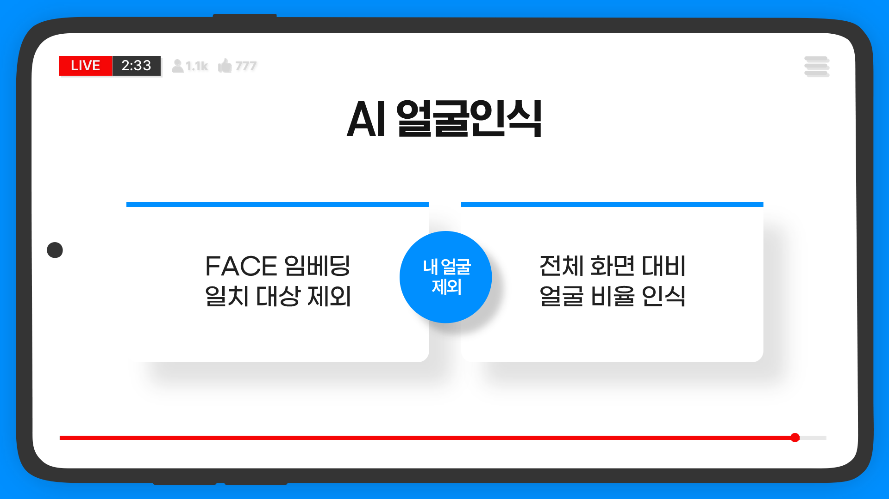 

## 🗺 시연
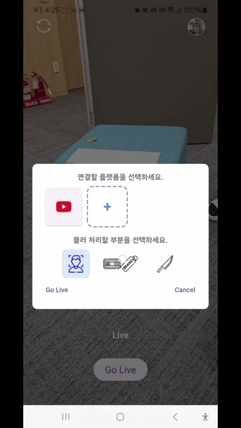 
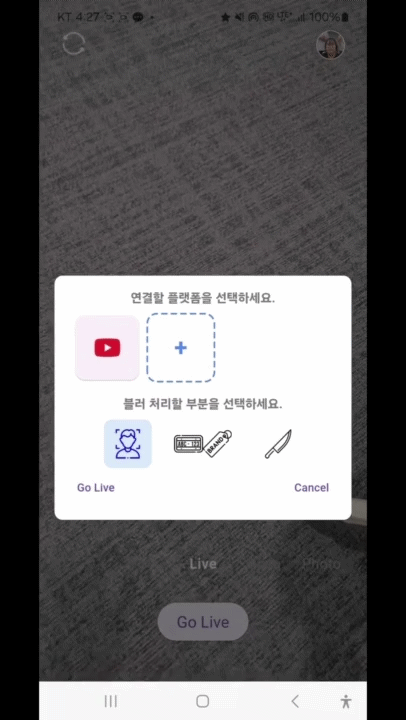 
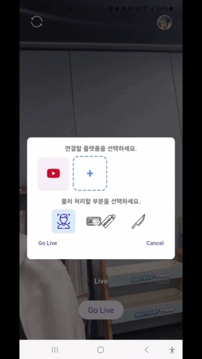 

